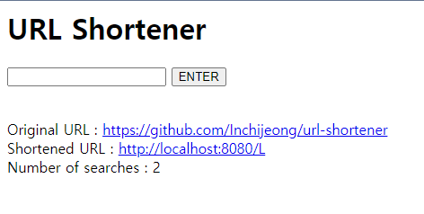

# URL Shortener





## 기능

1. URL을 입력받아 Shortened URL 생성.

2. Short URL 입력시 원래 URL로 리다이렉트.


## 환경

* SpringBoot 2.4.4
* MariaDB 10.5.8
* JPA
* Thymeleaf


## 빌드 및 실행

Linux(CentOS) 환경에서 배포/실행 순서.

리눅스 환경에서 개발&배포가 동시 이루어질 경우.

만약, 환경이 분리되어 있다면 개발 환경에서 War를 만들어 Tomacat에 넣어주는 방식으로 진행.


### MariaDB

1. yum repo 등록

   ```
   vi /etc/yum.repos.d/MariaDB.repo
   ```

   ```
   [mariadb]
   name = MariaDB
   baseurl = http://yum.mariadb.org/10.5/centos7-amd64
   gpgkey=https://yum.mariadb.org/RPM-GPG-KEY-MariaDB
   gpgcheck=1
   ```

2. MariaDB 설치

   ```
   yum install MariaDB
   ```

3. MariaDB 실행 및 비밀번호 변경

   ```
   # mariadb 실행
   systemctl start mariadb
   
   # 비밀번호 변경
   /usr/bin/mysqladmin -u root password '변경할 비밀번호 입력'
   
   # 포트 및 데몬 이름 확인
   netstat -anp | grep 3306
   ```

4. CharaterSet utf8mb4로 변경

   ```
   vi /etc/my.cnf
   ```

   ```
   [mysqld]
   default_storage_engine=innodb
   
   init-connect='SET NAMES utf8mb4'
   lower_case_table_names=1
   character-set-server=utf8mb4
   collation-server=utf8mb4_unicode_ci
   
   
   [client]
   port=3306
   default-character-set = utf8mb4
   
   [mysqldump]
   default-character-set = utf8mb4
   
   [mysql]
   default-character-set = utf8mb4
   ```

   ```
   systemctl restart mariadb
   ```

5. 계정 생성

   ```
   mysql -u root -p
   ```

   ```
   create user ‘uss_usr’@'%' identified by ‘uss_usr';
   ```

6. DB 생성

   ```
   create database uss
   ```

7. 권한 부여

   ```
   grant all privileges on ucc.* to ‘uss_usr'@'%'
   ```


### Tomcat

1. Tomcat 다운

   ```
   cd /tmp/lib
   ```

   ```
   wget http://archive.apache.org/dist/tomcat/tomcat-8/v8.5.27/bin/apache-tomcat-8.5.27.tar.gz
   ```

2. Tomcat 압축 해제

   ```
   tar xvfz apache-tomcat-8.5.27.tar.gz
   ```

3. 폴더 이동

   ```
   mv apache-tomcat-8.5.27/ /usr/local
   ```

   ```
   cd /usr/local
   ```

4. 심폴릭 링크

   ```
   ln -s apache-tomcat-8.5.27/ tomcat
   ```

5. 환경 변수 설정

   ```
   vi /etc/profile
   
   JAVA_HOME=/usr/local/java
   JRE_HOME=/usr/local/java
   CATALINA_HOME=/usr/local/tomcat
   CLASSPATH=.:$JAVA_HOME/lib/tools.jar:$CATALINA_HOME/lib/jsp-api.jar:$CATALINA_HOME/lib/servlet-api.jar
   PATH=$PATH:$JAVA_HOME/bin:$CATALINA_HOME/bin
   export JAVA_HOME CLASSPATH PATH CATALINA_HOME JRE_HOME
   ```

6. 설정 반영 및 변수 확인

   ```
   source /etc/profile
   ```

   ```
   echo $CATALINA_HOME
   ```

7. 방화벽  포트 오픈

   ```
   firewall-cmd --permanent --zone=public --add-port=8080/tcp
   ```

   ```
   firewall-cmd --reload
   ```

8. 실행/ 중지

   ```
   /usr/local/tomcat/bin/startup.sh
   ```

   ```
   /usr/local/tomcat/bin/shutdown.sh
   ```


### Gradle

1. Gradle 다운

   ```
   wget https://services.gradle.org/distributions/gradle-4.8.1-bin.zip
   ```

   ```
   sudo mkdir /opt/gradle
   ```

   ```
   sudo unzip -d /opt/gradle gradle-4.8.1-bin.zip
   ```

   ```
   ls /opt/gradle/gradle-4.8.1
   ```

2. 환경 변수 추가

   ```
   vi /etc/profile
   ```

   ```
   export GRADLE_HOME=/opt/gradle/gradle-4.8.1
   export PATH=$PATH:$GRADLE_HOME/bin
   export PATH
   ```

3. 설정 반영 및 변수 확인

   ```
   source /etc/profile
   ```

   ```
   gradle -v
   ```


### Git & Build

1. Git 다운

   ```
   yum install git
   ```

2. 소스 다운

   ```
   git clone https://github.com/Inchijeong/url-shortener.git
   ```

3. build

   ```
   cd url-shortener
   ```

   ```
   gradlew build
   ```

4. 폴더 이동

   ```
   mv ./build/libs/url-shortener-0.0.1-SNAPSHOT /usr/local/apache-tomcat-8.5.27/webapps
   ```

5. Tomcat 실행

   ```
   /usr/local/tomcat/bin/startup.sh
   ```

   